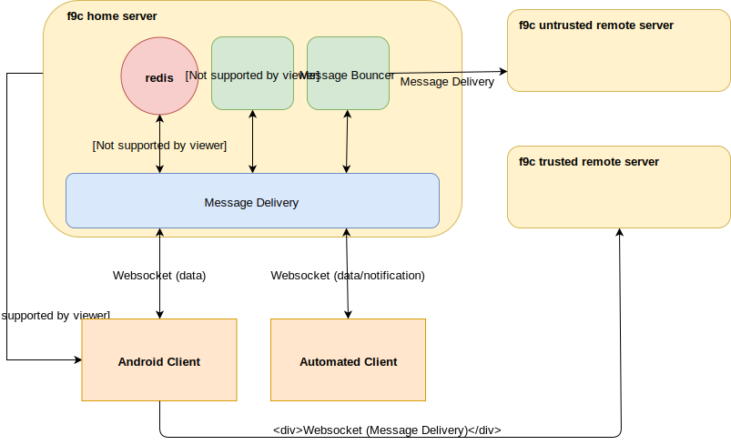

# Overview

# Concepts

## Public Key as address
Instead of a an account a client has a public key that is used as address for messages to this client. The server does 
not keep a list of existing accounts. If a client can decrypt a random challenge encrypted using the public key, the
server assumes, that the user may receive messages for this public key.

The only reason the server stores public keys is to prevent the redis store from overflowing when too many messages are
received for target addresses that have never successfully authenticated before (DOS attack). 

In regular intervals the client creates a new public key and sends it to all known parties (e.g. contacts and groups).
The messages for the old key are polled for some time after the switch to a new key. This way it becomes impossible to
create a database of addresses, since all addresses will become outdated after some time (if the client is not 
interested in keeping the database up-to-date). Also this allows switching to a new encryption scheme if the old one
becomes outdated. 

## Creating contacts
f9c does not support finding contacts. Instead a link containing the public key and the home server of a client has to 
be send on a pre-existing channel to the new contact. This link is then parsed by the client and the contact is added.

## User Profile Data
User profile is not stored on the server. Instead a message requesting the profile data is sent to the contact.
The contact may or may not answer this message

## Groups
There are two types of groups:

### Ad-hoc groups
Ad-hoc groups are implemented by the client sending messages to all groups members. This is useful for small groups.
The server does not have to know about the existence of these groups.

### Server Groups
For Server Groups the Group Server keeps a list of all members of the group. Each group has two public/private key pairs:
* a member key pair that is known to all group members. This is used to encrypt messages sent to the group
* an administration key pair that is used to verify the validity of group administration requests. This is only known to
  the group administrators.
  
For both key pairs the server only has to know the public keys.

# Components
## Message Delivery
The core component of f3c delivers messages between clients. A message consists of a public key that is used as 
address of the recipient and the raw data which is a simple byte array on this level.

Redis is used to store a mapping from the public key to the list of waiting messages.  
   
# Message Bouncer
In the case a client wants to deliver a message to an untrusted server (untrusted in this context means, that the client
does not want the server to know its IP Address) it instead sends a message to the message bouncer. The message bouncer
acts as a normal client. It receives the message, decrypts the payload and forwards the message to the target server.
## Transport Protocol
## Client Message Format